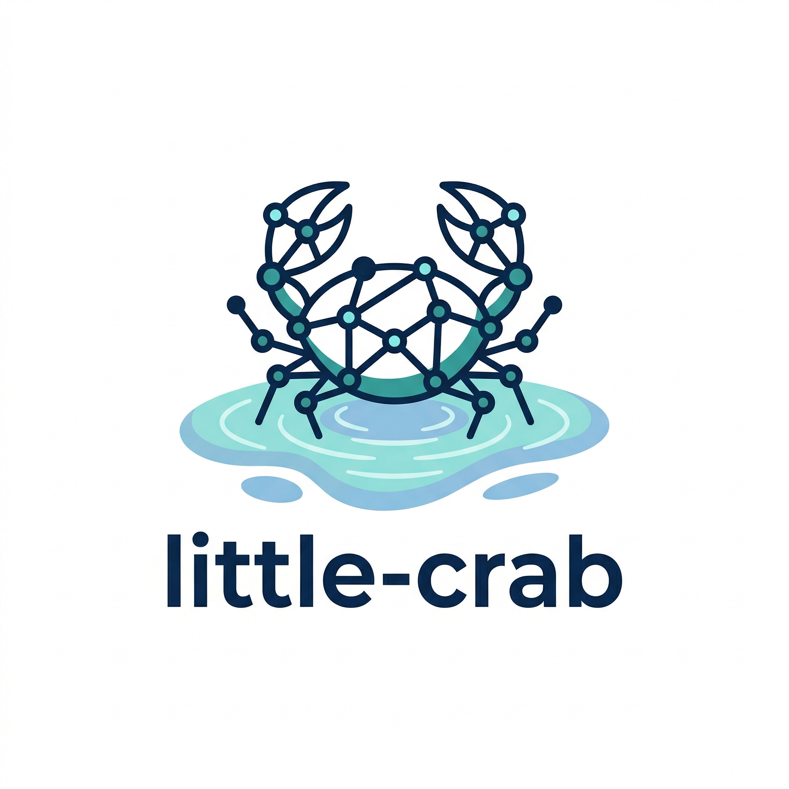

# little-crab

[한국어 README](README.ko.md)



little-crab is a local-first ontology and MCP runtime for people who want the OpenCrab grammar and agent workflow without the old server-backed database stack.

It preserves the OpenCrab grammar, validator behavior, MCP tool surface, and agentic ontology loop, but runs them on embedded local stores so the whole workflow can run on one machine.

## Quick Start

The fastest path is: install, initialize local config, verify the stores, and run one query.

The examples below assume `python` resolves to Python 3.11 or newer. On Windows systems where `python` still resolves to 3.10, use `py -3.12` instead.

### 1. Install

```bash
python -m pip install -e ".[dev]"
```

### 2. Initialize local config

```bash
littlecrab init
```

This creates `.env` with:

```env
STORAGE_MODE=local
LOCAL_DATA_DIR=./opencrab_data
CHROMA_COLLECTION=little_crab_vectors
MCP_SERVER_NAME=little-crab
MCP_SERVER_VERSION=0.1.0
LOG_LEVEL=INFO
```

### 3. Verify local stores and runtime closure

```bash
littlecrab status
littlecrab doctor
```

Expected outcome: `status` should show the local graph, documents, registry, and vectors stores as available, and `doctor` should confirm write -> ingest -> query closure in an isolated temp runtime.

### 4. Seed example data

```bash
python scripts/seed_ontology.py
```

Windows launcher fallback:

```bash
py -3.12 scripts/seed_ontology.py
```

### 5. Run one query

```bash
littlecrab query "system performance and error rates"
littlecrab manifest
```

Expected outcome: `query` should return hybrid retrieval output, and `manifest` should print the active MetaOntology grammar.

Short alias:

```bash
ltcrab query "system performance and error rates"
```

## Compatibility

The project name is `little-crab`. The current CLI and module contract is:

| Surface | Status | Notes |
| --- | --- | --- |
| `littlecrab` | canonical CLI | preferred in docs and examples |
| `ltcrab` | supported short alias | faster local typing |
| `little-crab` | legacy CLI alias | still available |
| `opencrab` | deprecated compatibility CLI alias | still available for compatibility |
| `opencrab` Python namespace | current import namespace | retained for compatibility |

## Runtime Truth

little-crab keeps the original MetaOntology grammar, validator behavior, MCP tool surface, and agentic ontology loop, but removes the legacy service stack.

- `LadybugDB` is the ontology graph truth for entities and relations.
- `DuckDB` is the documentary and operational truth for documents, audit events, registry, policies, impacts, and simulations.
- embedded `ChromaDB` is a derived vector index, not canonical truth.

This is an ownership-based SSOT model, not a single physical database.

## Connect Your Agent

Use this after the local quickstart succeeds.

### Codex MCP

Windows repo-local example:

```bash
codex mcp add little-crab ^
  --env PYTHONPATH=C:\path\to\little-crab ^
  --env STORAGE_MODE=local ^
  --env LOCAL_DATA_DIR=C:\path\to\little-crab\opencrab_data ^
  --env CHROMA_COLLECTION=little_crab_vectors ^
  --env MCP_SERVER_NAME=little-crab ^
  --env MCP_SERVER_VERSION=0.1.0 ^
  --env LOG_LEVEL=WARNING ^
  -- littlecrab serve
```

Then verify:

```bash
codex mcp list
```

Open a new Codex session after registration so the new MCP server is visible to the agent.

If `littlecrab` is not on your `PATH`, activate your virtualenv first. On Windows systems where `python` still resolves to 3.10, use the launcher fallback instead:

```bash
py -3.12 -m opencrab.cli serve
```

### Claude Code MCP

```bash
claude mcp add little-crab -- littlecrab serve
```

Compatibility aliases also work:

```bash
claude mcp add little-crab -- ltcrab serve
claude mcp add little-crab -- little-crab serve
claude mcp add little-crab -- opencrab serve   # deprecated compatibility alias
```

### Claude Code MCP Configuration

```json
{
  "mcpServers": {
    "little-crab": {
      "command": "littlecrab",
      "args": ["serve"],
      "env": {
        "LOCAL_DATA_DIR": "./opencrab_data"
      }
    }
  }
}
```

## Common Tasks

Good starter requests for an agent:

- `먼저 ontology_manifest로 문법을 보여주고, 이 저장소에 맞는 공간 구성을 설명해줘.`
- `knowledge/inbox 폴더 문서들을 읽고 중요한 텍스트를 ontology_ingest 해줘.`
- `같은 문서들에서 concept, claim, evidence를 ontology_extract로 부트스트랩해줘.`
- `cache ttl, reliability, incident report 관련 내용을 ontology_query로 찾아줘.`
- `Alice가 events-dataset을 볼 수 있는지 ontology_rebac_check로 검사해줘.`

Useful prompt pattern:

```text
1. 먼저 ontology_manifest로 현재 문법을 확인해.
2. knowledge/inbox 아래 문서 중 관련 있는 것만 읽어.
3. 중요한 본문은 ontology_ingest 해.
4. 필요한 경우 ontology_extract로 부트스트랩해.
5. 마지막에는 ontology_query 또는 impact/rebac/simulation으로 답을 정리해.
```

For a more detailed usage guide, see [docs/USAGE_GUIDE.md](docs/USAGE_GUIDE.md).

## Runtime Caveats

- `AgentContextPipeline` is derived context for agents, not a second SSOT.
- Scoped queries such as `--project` or `--source-id-prefix` intentionally disable graph expansion.
- `ontology_query` returns legacy `results` plus derived `context` and `graph_expansion`.
- `littlecrab query` and `ontology_query` now also expose confirmed vs inferred fact counts, evidence counts, provenance path counts, and missing-link counts.
- `staged_operations` is workflow state in DuckDB, not canonical ontology truth.
- little-crab is designed for graceful degradation, but canonical graph writes are not treated as success when the graph store did not persist them.

Scoped query example:

```bash
littlecrab query "error rates" --project demo
littlecrab query "cache ttl" --source-id-prefix docs/
```

## Why little-crab

What stays the same:

- 9-space MetaOntology grammar
- grammar validation rules
- MCP tool names:
  - `ontology_manifest`
  - `ontology_add_node`
  - `ontology_bulk_add_nodes`
  - `ontology_add_edge`
  - `ontology_bulk_add_edges`
  - `ontology_query`
  - `ontology_impact`
  - `ontology_rebac_check`
  - `ontology_lever_simulate`
  - `ontology_extract`
  - `ontology_ingest`
- guided, partial-knowledge ontology workflow for agent use

What changed:

- no Docker requirement
- no Neo4j, MongoDB, or PostgreSQL dependency
- local-first runtime only
- designed to preserve OpenCrab semantics while making day-to-day local use practical

## Recommended Workspace Layout

Keep runtime data separate from source material.

```text
your-project/
├── knowledge/
│   ├── inbox/        # raw notes, docs, reports, transcripts
│   ├── curated/      # cleaned or important reference docs
│   └── exports/      # optional generated summaries or extracts
├── opencrab_data/    # local runtime data created by little-crab
└── ...
```

Guidance:

- Put files you want the agent to learn from under `knowledge/inbox/` or `knowledge/curated/`.
- Do not manually edit `opencrab_data/`; it is runtime state, not source material.
- Prefer `.md`, `.txt`, `.py`, and short plain-text documents when starting out.

## Loading Material

For batch ingestion from disk:

```bash
littlecrab ingest ./knowledge/inbox -r
littlecrab ingest ./knowledge/curated -r
```

For agent-driven work over MCP:

- Ask the agent to read one or more files.
- Ask it to call `ontology_ingest` for semantic retrieval.
- Ask it to call `ontology_extract` if you want bootstrap nodes or edges.
- Ask it to call `ontology_query`, `ontology_rebac_check`, `ontology_impact`, or `ontology_lever_simulate` for follow-up analysis.

## Staged Writes

If you want a draft-before-publish workflow instead of writing straight into canonical truth:

```bash
littlecrab stage-node resource Document draft-doc --property name="Draft Doc"
littlecrab list-staged
littlecrab publish-stage <stage-id>
```

Staged operations live in DuckDB workflow state only. They do not become canonical ontology truth until `publish-stage` succeeds.

## CLI Reference

```text
littlecrab init                              Create .env from template
littlecrab serve                             Start MCP server (stdio)
littlecrab status                            Check embedded store connections
littlecrab doctor                            Run runtime health + closure smoke
littlecrab ingest <path> [-r] [-e .md,.txt]  Ingest files into vector store
littlecrab query <question> [--spaces ...]   Run a hybrid query
littlecrab query <question> [--project ...]  Run a scoped query
littlecrab manifest [--json-output]          Print MetaOntology grammar
littlecrab stage-node ...                    Stage a node write
littlecrab stage-edge ...                    Stage an edge write
littlecrab list-staged                       List staged writes
littlecrab publish-stage <stage-id>          Publish one staged write
```

Compatibility aliases:

```text
ltcrab <same-command>
little-crab <same-command>
opencrab <same-command>   # deprecated
```

## Repo Map

```text
opencrab/
├── cli.py              # canonical CLI implementation
├── grammar/            # MetaOntology grammar and validation
├── stores/             # LadybugDB, DuckDB, ChromaDB adapters
├── ontology/           # Builder, query, ReBAC, impact, extractor, context pipeline
└── mcp/                # MCP server and tool definitions
tests/                  # Local-first test suite
scripts/                # Seed, verification, and dogfooding helpers
docs/                   # Canonical architecture and current-state docs
```

## Troubleshooting

- If `ltcrab` is not recognized after upgrading, reinstall the editable package: `python -m pip install -e . --no-deps --force-reinstall`
- On Windows, prefer `py -3.12` when `python` does not resolve to a supported interpreter.
- The short alias is `ltcrab`, not `ltrcrab`.

## Development

```bash
make dev-install
make seed
make status
make test-py312
make verify-intelligence
make dogfood-mcp
make lint
make format
```

Cross-platform examples above assume `python` resolves to a supported interpreter.

Canonical Windows verification:

```bash
py -3.12 scripts/verify_repo_intelligence.py
py -3.12 -m pytest tests/test_cli.py tests/test_mcp.py tests/test_stores.py
py -3.12 scripts/dogfood_mcp.py
```

To refresh checked-in MCP session evidence:

```bash
py -3.12 scripts/dogfood_mcp.py --transcript-dir docs/evidence/agent_sessions/latest
```

## License

MIT
